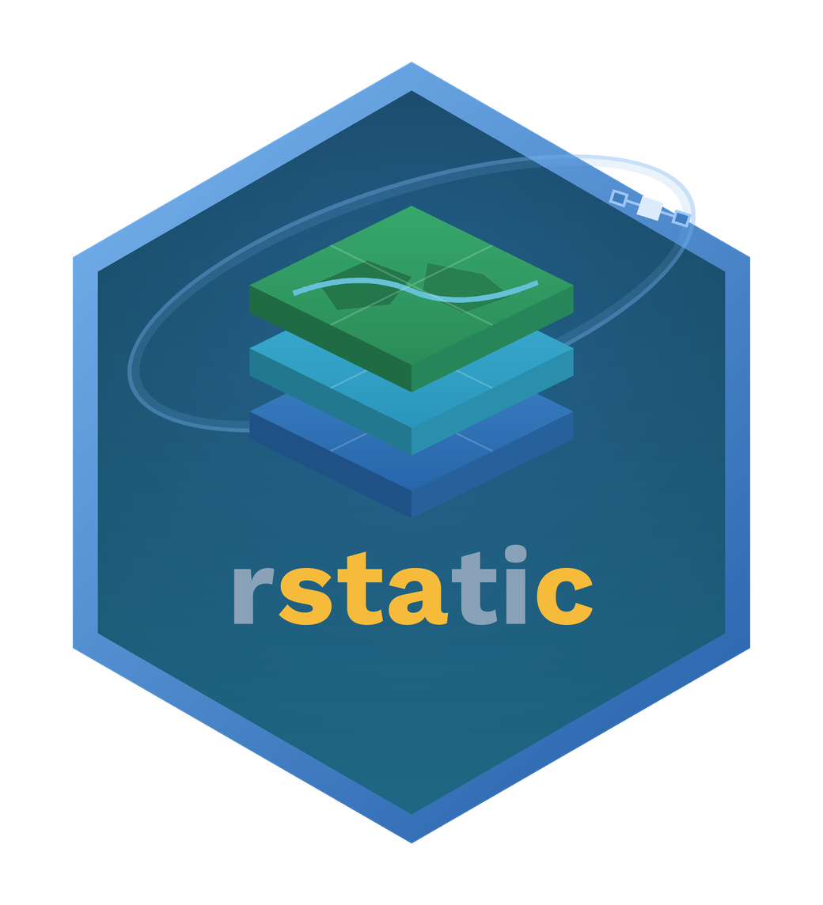

<!-- README.md is generated from README.Rmd. Please edit that file -->

```{r, include = FALSE}
knitr::opts_chunk$set(
  collapse = TRUE,
  comment = "#>",
  fig.path = "man/figures/README-",
  out.width = "100%"
)
```

# rstatic 

Build browsable, **static** SpatioTemporal Asset Catalogs (STAC)
from R.

<!-- badges: start -->
[](https://github.com/rolfsimoes/rstatic/blob/main/LICENSE.md)
[](https://github.com/rolfsimoes/rstatic/actions/workflows/R-CMD-check.yaml)
[](https://lifecycle.r-lib.org/articles/stages.html#experimental)
[](https://github.com/radiantearth/stac-spec)
<!-- badges: end -->

`rstatic` generates a folder with valid [STAC](https://stacspec.org/) catalog
that you can publish anywhere (e.g. GitHub Pages, an S3 bucket, or a plain web
server). No database and no running service are required.

It does this through small set of composable **primitives** for STAC catalogs,
collections, items, assets, and links. This makes `rstatic` a useful foundation
for higher-level tools such as STAC generators and catalog builders. It
implements STAC specification version 1.0.0.

## Features

- Intuitive builders of catalogs, collections, items, assets, and links.
- Track spatial and temporal extents automatically as items are added.
- Extract bounding boxes from rasters, render PNG thumbnail
  assets, and import QGIS layer styles.

## Installation

You can install the development version of `rstatic` from GitHub with:

``` r
# install.packages("remotes")
remotes::install_github("rolfsimoes/rstatic")
```

## Usage

The example below builds a minimal static catalog with one collection and one
item, writing the JSON tree under a temporary directory.

```{r example}
library(rstatic)

root <- tempfile("stac-")

# 1. Build the documents in memory (pure -- nothing is written yet)
catalog <- new_catalog(
  id = "example",
  title = "Example Catalog",
  description = "A minimal static STAC catalog"
)

collection <- new_collection(
  id = "land-cover",
  title = "Land Cover",
  description = "Example land cover collection"
)

item <- new_item(
  id = "land-cover-2020",
  bbox = c(-50, -10, -49, -9),
  properties = new_properties(datetime = "2020-01-01T00:00:00Z"),
  assets = list(
    data = new_asset("land-cover-2020.tif", title = "Land Cover 2020")
  )
)

# 2. Link them with the pure add_*() builders
collection <- add_items(collection, item)
catalog <- add_collection(catalog, collection)

# 3. Persist
stac_save(catalog = catalog, collection = collection, items = item,
          root_dir = root)
```

The resulting directory follows the canonical static catalog layout, with the
collection linking to its item:

```{r tree}
list.files(file.path(root, "stac"), recursive = TRUE)
```

Each file is a self-contained STAC document. To extend a catalog that is
already on disk, read it back with `stac_read()`, add to it, and save again.
Saving is a pure overwrite, so reading first is what preserves the existing
children.

## Core primitives

```{r primitives, echo=FALSE}
tibble::tribble(
  ~"Function", ~"Purpose",
  "`new_catalog()`, `new_collection()`", "Build catalogs and collections in memory",
  "`new_item()`, `new_properties()`, `new_asset()`", "Build items, properties and assets",
  "`add_collection()` / `add_items()`", "Attach a collection/items to a parent, return it",
  "`add_link()` / `add_asset()`", "Attach links and assets",
  "`stac_read()`", "Read a document from disk (load-or-create with `default`)",
  "`stac_save()`", "Write documents to their canonical paths (the only writer)",
  "`extract_bbox()` / `as_geometry()`", "Spatial metadata helpers",
  "`stac_style()` / `qml_to_style()`", "Thumbnail style objects",
  "`new_thumbnail()`", "Describe a PNG thumbnail asset (rendered on save)"
) |> knitr::kable(format = "markdown")
```

`new_*()` constructors and `add_*()` builders never touch disk;
`stac_read()` and `stac_save()` are the only functions that do.

## Documentation

- Full function reference and articles:
  <https://rolfsimoes.github.io/rstatic/>
- Get started: `vignette("rstatic")`
- Per-function help, e.g. `?stac_save`

## Getting help

Found a bug or have a feature request? Please open an issue at
<https://github.com/rolfsimoes/rstatic/issues>.

## Related work

`rstatic` focuses on *writing* static catalogs from primitives. If you instead
need to *query* remote STAC APIs from R, see
[`rstac`](https://github.com/brazil-data-cube/rstac).

## License

GPL (>= 3). See [LICENSE.md](LICENSE.md).
